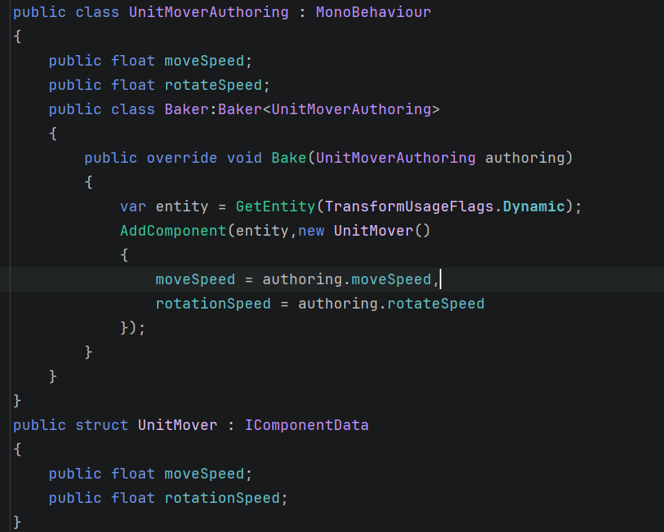
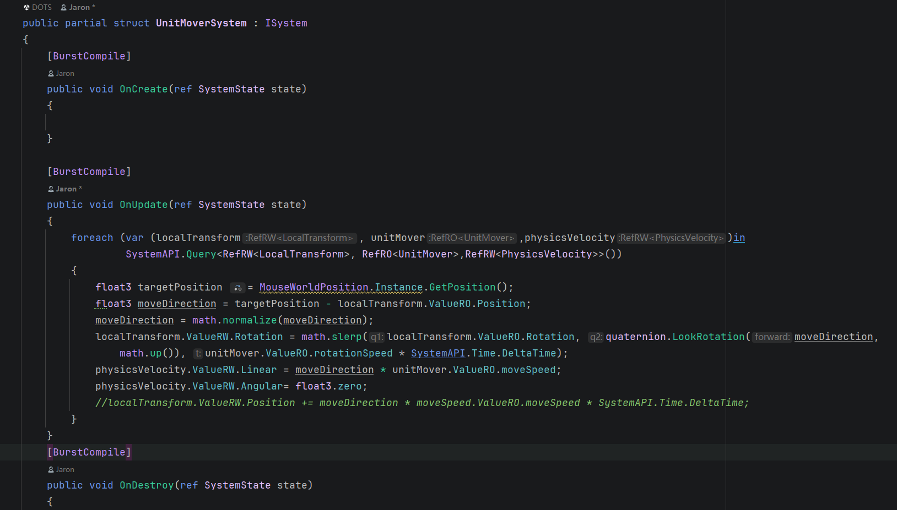

# DOTS

## ECS

### Mono的“不连续内存”和ECS的“连续内存”

- **`MonoBehaviour`/`OOP`的内存结构**

  每个对象是单独分配在堆上的，地址是随机分散的

  ```
  Enemy1 → 0x1000
  Enemy2 → 0x8A23
  Enemy3 → 0x41F0
  Enemy4 → 0xC120
  ```

  访问时：

  ```
  CPU:
  跳 → 0x1000
  跳 → 0x8A23
  跳 → 0x41F0
  ```

  问题：内存分散，cache miss多，性能差

- **`ECS`的内存结构**

  `ECS`是连续内存布局，相同数据连续分布在一起，对CPU缓存友好

  Unity把相同组件组合的数据放进Chunk（16KB连续内存）：

  ```
  Chunk:
  
  Position: [P1][P2][P3][P4][P5]
  Velocity: [V1][V2][V3][V4][V5]
  ```

  访问时：

  ```c#
  foreach (var pos in SystemAPI.Query<RefRW<Position>>())
  {
      pos.ValueRW.x += 1;
  }
  ```

  ```
  CPU 一次读取：
  [P1 P2 P3 P4 P5]
  ```

  特点：顺序访问，cache命中高

  - **关键结论**

    - `struct`本身并不保证连续内存
    - `ECS`的Chunk+Archetype才保证连续

  - **核心机制**

    ```
    Archetype = 组件组合类型
    
    例如：
    [Position + Velocity]
    
    ↓
    
    Chunk（只存这一类Entity）：
    
    [Position数组][Velocity数组]
    ```

    

### Entity

通过在场景中创建`subScene`，在`subScene`中创建的物体会被烘焙为`Entity`

### Component

自定义的`Component`通过继承`IComponentData`接口来实现，只包含数据，也不必像在`MonoBehaviour`中对一个数据进行`private`私有化并用一个属性暴露接口，直接用`public`修饰即可。

自定义的`Component`加到`Entity`上可以通过继承`Baker<T>`类来实现，并`override`其中的`Bake`函数即可，但是需要额外新增一个继承`MonoBehaviour`的脚本挂载到`Unit`身上来执行这段逻辑：



`Mono`能让我们在Inspector窗口中直接填参数

### System

#### ISystem和SystemBase的区别

`ISystem`是接口，能用结构体继承实现，`SystemBase`是抽象类，一般使用`ISystem`，因为其无GC且对Burst友好。

> GC的本质是在堆上分配的对象变成了垃圾，需要进行回收，并不是使用了引用类型就一定会触发GC



由于`Entity`上挂载的都是`struct`，如果直接获取获取到的是副本，并不会对内存中的数据产生影响，所以使用`ref`引用传递。

`RefRW`代表 Read&Write ，`RefRO`代表 ReadOnly