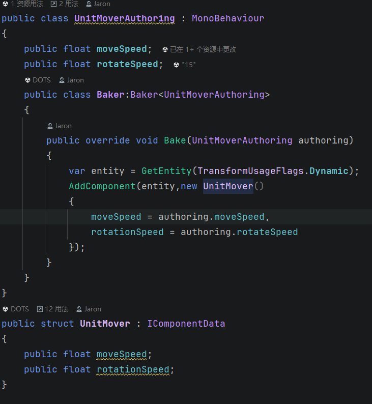
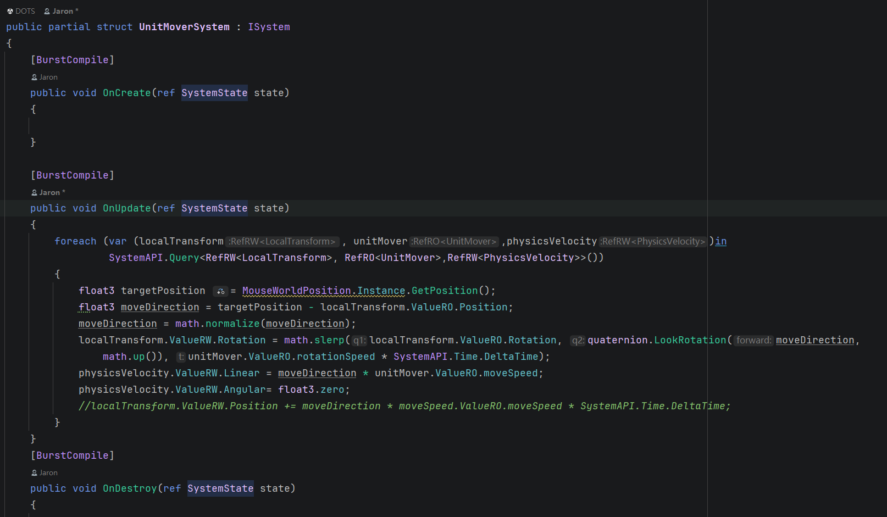
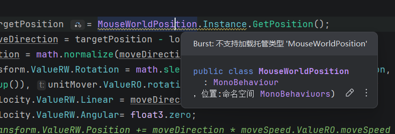
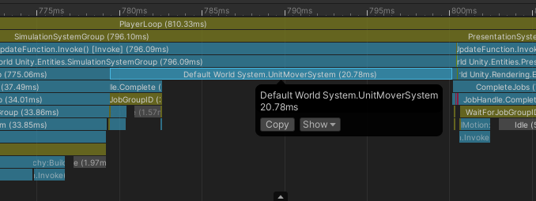
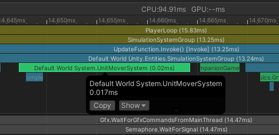
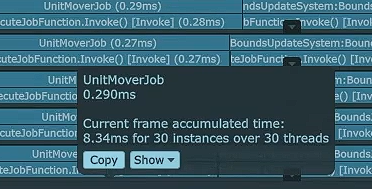
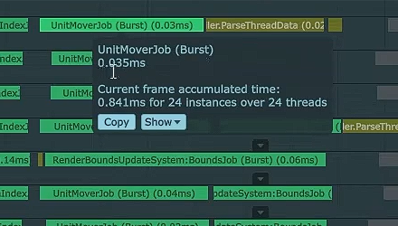

# DOTS

## DOTS概述

DOTS = **Data-Oriented Technology Stack**，是Unity面向高性能的数据导向技术栈，由三个核心部分组成：
| 组件                              | 作用         | 核心优势                    |
| --------------------------------- | ------------ | --------------------------- |
| **ECS** (Entity Component System) | 数据组织方式 | 连续内存布局，Cache友好     |
| **JobSystem**                     | 多线程调度   | 充分利用多核CPU             |
| **Burst Compiler**                | 编译优化     | 将C#编译为高性能Native Code |

### 三者协作关系
ECS（提供连续内存布局）
        ↓
JobSystem（并行调度任务到多核）
        ↓
Burst（将Job编译为SIMD机器码）
        ↓
    极致性能

### 适用场景
- 游戏中需要处理大量同类型实体（成千上万的子弹、NPC、粒子）
- CPU密集型计算（寻路、物理、AI决策）
- 需要稳定60fps的场景
### 不适用场景
- UI逻辑、少量对象管理
- 需要频繁与传统MonoBehaviour交互的系统

## ECS

### Mono的“不连续内存”和ECS的“连续内存”

- **`MonoBehaviour`/`OOP`的内存结构**

  每个对象是单独分配在堆上的，地址是随机分散的

  ```
  Enemy1 → 0x1000
  Enemy2 → 0x8A23
  Enemy3 → 0x41F0
  Enemy4 → 0xC120
  ```

  访问时：

  ```
  CPU:
  跳 → 0x1000
  跳 → 0x8A23
  跳 → 0x41F0
  ```

  问题：内存分散，cache miss多，性能差

- **`ECS`的内存结构**

  `ECS`是连续内存布局，相同数据连续分布在一起，对CPU缓存友好

  Unity把相同组件组合的数据放进Chunk（16KB连续内存）：

  ```
  Chunk:
  
  Position: [P1][P2][P3][P4][P5]
  Velocity: [V1][V2][V3][V4][V5]
  ```

  访问时：

  ```c#
  foreach (var pos in SystemAPI.Query<RefRW<Position>>())
  {
      pos.ValueRW.x += 1;
  }
  ```

  ```
  CPU 一次读取：
  [P1 P2 P3 P4 P5]
  ```

  特点：顺序访问，cache命中高

  - **关键结论**

    - `struct`本身并不保证连续内存
    - `ECS`的Chunk+Archetype才保证连续

  - **核心机制**

    ```
    Archetype = 组件组合类型
    
    例如：
    [Position + Velocity]
    
    ↓
    
    Chunk（只存这一类Entity）：
    
    [Position数组][Velocity数组]
    ```

    

### Entity

通过在场景中创建`subScene`，在`subScene`中创建的物体会被烘焙为`Entity`

### Component

自定义的`Component`通过继承`IComponentData`接口来实现，只包含数据，也不必像在`MonoBehaviour`中对一个数据进行`private`私有化并用一个属性暴露接口，直接用`public`修饰即可。

自定义的`Component`加到`Entity`上可以通过继承`Baker<T>`类来实现，并`override`其中的`Bake`函数即可，但是需要额外新增一个继承`MonoBehaviour`的脚本挂载到`Unit`身上来执行这段逻辑：



`Mono`能让我们在Inspector窗口中直接填参数

### System

#### ISystem和SystemBase的区别

`ISystem`是接口，能用结构体继承实现，`SystemBase`是抽象类，一般使用`ISystem`，因为其无GC且对Burst友好。

> GC的本质是在堆上分配的对象变成了垃圾，需要进行回收，并不是使用了引用类型就一定会触发GC



由于`Entity`上挂载的都是`struct`，如果直接获取获取到的是副本，并不会对内存中的数据产生影响，所以使用`ref`引用传递。

`RefRW`代表 Read&Write ，`RefRO`代表 ReadOnly。



>  由于`MosueWorldPosition`是继承了`Mono`的单例，在用`[BurstCompile]`属性标记的函数下会发生报错，但不会卡死游戏，可以通过在`UnitMover`中新增一个`targetPosition`字段，并在一个`Mono`脚本中来修改`UnitMover的targetPosition`字段来做到`Mono`脚本和`DOTS`脚本的分离


##  JobSystem

在`subScene`中放置成千上万个`Unit`，并执行其移动逻辑

```c#
    public partial struct UnitMoverSystem : ISystem
    {
        [BurstCompile]
        public void OnUpdate(ref SystemState state)
        {
            foreach (var (localTransform, unitMover,physicsVelocity)in 
                     SystemAPI.Query<RefRW<LocalTransform>, RefRO<UnitMover>,RefRW<PhysicsVelocity>>())
            {
                float3 targetPosition = unitMover.ValueRO.targetPosition;
                float3 moveDirection = targetPosition - localTransform.ValueRO.Position;
                moveDirection = math.normalize(moveDirection);
                localTransform.ValueRW.Rotation = math.slerp(localTransform.ValueRO.Rotation, quaternion.LookRotation(moveDirection, 
                    math.up()), unitMover.ValueRO.rotationSpeed * SystemAPI.Time.DeltaTime);
                physicsVelocity.ValueRW.Linear = moveDirection * unitMover.ValueRO.moveSpeed;
                physicsVelocity.ValueRW.Angular= float3.zero;
            }
        }
```

> 不使用JobSystem只在MainThread上进行计算



耗时如上图，大概在20ms左右

```c#
       [BurstCompile]
        public partial struct UnitMoverJob : IJobEntity
        {
            public float deltaTime;
            public void Execute(ref LocalTransform localTransform,in UnitMover unitMover,ref PhysicsVelocity physicsVelocity)
            {
                float3 targetPosition = unitMover.targetPosition;
                float3 moveDirection = targetPosition - localTransform.Position;
                float reachedTargetDistanceSq = 2f;
                //在精度不需要特别准确的情况下，使用平方距离进行比较可以避免开平方运算，提高性能
                if (math.lengthsq(moveDirection) < reachedTargetDistanceSq)
                {
                    physicsVelocity.Linear=float3.zero;
                    physicsVelocity.Angular=float3.zero;
                    return;
                }
                moveDirection = math.normalize(moveDirection);
                localTransform.Rotation = math.slerp(localTransform.Rotation, quaternion.LookRotation(moveDirection, 
                    math.up()), unitMover.rotationSpeed * deltaTime);
                physicsVelocity.Linear = moveDirection * unitMover.moveSpeed;
                physicsVelocity.Angular= float3.zero;
            }
        }
```

>  ref 引用可读可写，in 引用只能读


```c#
    public partial struct UnitMoverSystem : ISystem
    {
        [BurstCompile]
        public void OnUpdate(ref SystemState state)
        {
            UnitMoverJob unitMoverJob = new UnitMoverJob()
            {
                deltaTime = SystemAPI.Time.DeltaTime
            };
            unitMoverJob.ScheduleParallel();
        }
```

> 使用JobSystem并行计算，充分利用CPU的每一个核心



耗时直接下降到0.017秒左右！


## Burst

- 使用JobSystem但不开启Burst编译



每个UnitMoverJob耗时如上图所示

- 使用JobSystem且开启Burst编译



每个UnitMoverJob的耗时也下降了很多
